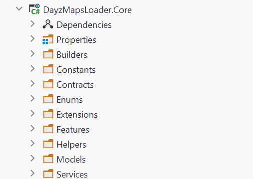
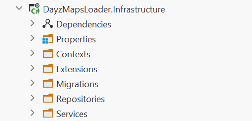
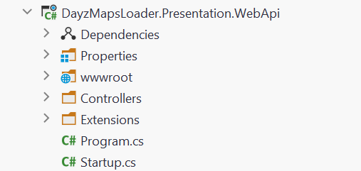

<a name="readme-top"></a>

<!-- PROJECT SHIELDS -->
<!--
*** I'm using markdown "reference style" links for readability.
*** Reference links are enclosed in brackets [ ] instead of parentheses ( ).
*** See the bottom of this document for the declaration of the reference variables
*** for contributors-url, forks-url, etc. This is an optional, concise syntax you may use.
*** https://www.markdownguide.org/basic-syntax/#reference-style-links
-->
<div align="center">
  
[![Contributors][contributors-shield]][contributors-url]
[![Forks][forks-shield]][forks-url]
[![Stargazers][stars-shield]][stars-url]
[![Issues][issues-shield]][issues-url]
[![MIT License][license-shield]][license-url]
[![LinkedIn][linkedin-shield]][linkedin-url]
  
</div>

<!-- PROJECT LOGO -->
<br />
<div align="center">
  <a href="https://github.com/SaintZet/DayzMapsLoader">
    
  </a>

  <p align="center">
    Select your map, create a good stuff!    
    <br />
    <a href="https://github.com/SaintZet/DayzMapsLoader/wiki"><strong>Explore the docs »</strong></a>
    <br />
    <br />
    <a href="https://github.com/SaintZet/DayzMapsLoader">View Demo</a>
    ·
    <a href="https://github.com/SaintZet/DayzMapsLoader/issues">Report Bug</a>
    ·
    <a href="https://github.com/SaintZet/DayzMapsLoader/issues">Request Feature</a>
  </p>
</div>


<!-- TABLE OF CONTENTS -->
<details>
  <summary>Table of Contents</summary>
  <ol>
    <li>
      <a href="#about-the-project">About The Project</a>
      <ul>
        <li><a href="#built-with">Built With</a></li>
        <li><a href="#architecture">Architecture</a></li>
        <li><a href="#solution-structure">Solution Structure</a></li>
      </ul>
    </li>
    <li>
      <a href="#getting-started">Getting Started</a>
      <ul>
        <li><a href="#prerequisites">Prerequisites</a></li>
        <li><a href="#installation">Installation</a></li>
      </ul>
    </li>
    <li><a href="#usage">Usage</a></li>
    <li><a href="#roadmap">Roadmap</a></li>
    <li><a href="#contributing">Contributing</a></li>
    <li><a href="#license">License</a></li>
    <li><a href="#contacts">Contacts</a></li>
    <li><a href="#acknowledgments">Acknowledgments</a></li>
  </ol>
</details>


<!-- ABOUT THE PROJECT -->
## About The Project

This Github pet project is an application built with Domain-Driven Design (DDD) architecture and modern development patterns. It has a server component built using ASP.NET Core and a client component built using React. 

The main purpose of this project is to allow users to download maps for the game DayZ from two different map providers: Ginfo and Xam. The downloaded maps are of high quality and can be used to create posters, cups, or other stuff. 

This repository are also a small personal library of knowledge.

<p align="right">(<a href="#readme-top">back to top</a>)</p>


### Built With
* [![.NET 6][.Net]][.Net-url]
* [![MicrosoftSQLServer][MicrosoftSQLServer]][MicrosoftSQLServer-url]
* [![Swagger][Swagger]][Swagger-url]
* [![React][React.js]][React-url]
* [![ReactQuery][ReactQuery]][ReactQuery-url]
* [![TypeScript][TypeScript]][TypeScript-url]

<p align="right">(<a href="#readme-top">back to top</a>)</p>


### Architecture
The concept of a Clean Architecture pattern has been around for over a decade and initially conceived by Robert Martin. The keyword from Uncle Bob is Interchangeable. In the image below, everything on the blue circle is **interchangeable**, for e.g., the UI can be swapped out from React to Angular, or the database can be migrated from MySQL to Oracle, and nothing in the underlying layers need to change.

The concept of having all your interfaces (Infrastructure and Application) in one project, will make it easier to Unit Test and mock.

<div align="center">
  <a href="https://github.com/SaintZet/DayzMapsLoader">
    
  </a>
</div>

<p align="right">(<a href="#readme-top">back to top</a>)</p>

### Solution Structure
<details>
  <summary>Domain layer</summary>
      I used Anemic Domain Model. Is used in DDD when the main focus is on data persistence and 
      becouse in this project there's not much need for complex business logic.<br>
      A Rich Domain Model is preferred when complex business logic needs to be encapsulated within the entities.<br>
    <br>
    <div align="left">
      <a href="https://github.com/SaintZet/DayzMapsLoader/tree/master/src/DayzMapsLoader.Domain">
      <!-- Images/SolutionTree/domain.png -->
        
      </a>
    </div>
</details>

<details> <summary>Application layer</summary>
  <i>Public components</i>
  <br>
  <li> Abstactions - interaces for Infrastructure layer (patter Repository) and for Services.</li>
  <li> Features - Queries and Commands for pattern CQRS.</li>
  <li> Extensions - here we have method for configure this layer for DI container.</li>
  <br>
  <i>Internal components</i>
  <br>
  <li> Wrappers - wrappers over awkward types.</li>
  <li> Services - CQRS Handlers use it for get result.</li>
  <li> Managers - internal services.</li>
  <li> Helpers - bad practice, but this classes maked code more readable by grouping related functions and providing a clear purpose for the code.</li>
  <br>
  <div align="left">
    <a href="https://github.com/SaintZet/DayzMapsLoader/tree/master/src/DayzMapsLoader.Application">
    <!-- Images/SolutionTree/domain.png -->
      
    </a>
  </div>
</details>

<details> <summary>Infrastructure layer</summary>
  <i>Public components</i>
  <br>
  <li> Contexts - data base contexts (EntityFramework).</li>
  <li> Migrations - data base migrations (EntityFramework).</li>
  <li> Repositories - implement pattern Reposity. </li>
  <li> Extensions - here we have method for configure this layer for DI container.</li>
  <br>
  <div align="left">
    <a href="https://github.com/SaintZet/DayzMapsLoader/tree/master/src/DayzMapsLoader.Infrastructure">
    <!-- Images/SolutionTree/domain.png -->
      
    </a>
  </div>
</details>

<details> <summary>Presentation layer</summary>
  <i>Public components</i>
  <br>
  <li> wwwroot - have custom UI for Swagger.</li>
  <li> Controllers - connection between Application and Client(web, desktop, mobile).</li>
  <li> Extensions - here we have method for configure DI container.</li>
  <br>
  <div align="left">
    <a href="https://github.com/SaintZet/DayzMapsLoader/tree/master/src/DayzMapsLoader.Presentation.WebApi">
    <!-- Images/SolutionTree/domain.png -->
      
    </a>
  </div>
</details>

<p align="right">(<a href="#readme-top">back to top</a>)</p>

<!-- GETTING STARTED -->
## Getting Started

This is an example of how you may give instructions on setting up your project locally.
To get a local copy up and running follow these simple example steps.

### Prerequisites

This is an example of how to list things you need to use the software and how to install them.
* npm
  ```sh
  npm install npm@latest -g
  ```
 * Dotnet ef
     ```sh
     dotnet tool install --global dotnet-ef
     ```

### Installation

1. Clone the repo
   ```sh
   git clone https://github.com/SaintZet/DayzMapsLoader.git
   ```
2. Install NPM packages
   ```sh
   npm install
   ```
3. Add connection string to appsettings.json 
   ```json
     "ConnectionStrings": {
    "DefaultConnection": "Server = YourServer; DataBase=DayzMapLoader; User id= YourUserID; password= YourPassword; Integrated Security=True; TrustServerCertificate=True;"
    }
   ```
 4. At this point you can have EF create database and create schema from the migration .NET CLI:
     ```sh
     dotnet ef database update
     ```

<p align="right">(<a href="#readme-top">back to top</a>)</p>


<!-- USAGE EXAMPLES -->
## Usage

At the moment you can install the latest version of the product to start the server and get all the necessary maps. 
You know what to do with them.

You can create a fork and expand the repository, for example 
* create a desktop client 
* change image processing algorithms
* add functionality that is useful to you
* other

Take some techniques and approaches to your projects.

And of course - to contribute to the development of the project, help with existing issues or create a new one, improve the algorithm or change something else!

<p align="right">(<a href="#readme-top">back to top</a>)</p>


<!-- ROADMAP -->
## Roadmap

- [x] Provide arhive(web) and byte array(desktop) with
    - [x] selected map
    - [x] selected map in parts
    - [x] all maps by specific provider
- [ ] Option for select map
    - [x] provider (GInfo e.g.)
    - [x] name (Chernarus e.g)
    - [ ] type
        - [x] satellite
        - [x] topographic
        - [ ] tourist
    - [x] zoom level
    - [ ] version
    - [ ] image quality
    - [ ] image extension
 - [ ] Client application (in process)
 - [ ] Hosting server and client
 - [ ] Improve performance - store images on the server and just download when choose something (e.g version map).

See the [open issues](https://github.com/SaintZet/DayzMapsLoader/issues) for a full list of proposed features (and known issues).

<p align="right">(<a href="#readme-top">back to top</a>)</p>


<!-- CONTRIBUTING -->
## Contributing

Contributions are what make the open source community such an amazing place to learn, inspire, and create. Any contributions you make are **greatly appreciated**.

If you have a suggestion that would make this better, please fork the repo and create a pull request. You can also simply open an issue with the tag "enhancement".
Don't forget to give the project a star! Thanks again!

1. Fork the Project
2. Create your Feature Branch (`git checkout -b feature/AmazingFeature`)
3. Commit your Changes (`git commit -m 'Add some AmazingFeature'`)
4. Push to the Branch (`git push origin feature/AmazingFeature`)
5. Open a Pull Request

<p align="right">(<a href="#readme-top">back to top</a>)</p>


<!-- LICENSE -->
## License

Distributed under the MIT License. See `LICENSE.txt` for more information.

<p align="right">(<a href="#readme-top">back to top</a>)</p>


<!-- CONTACTS -->
## Contacts

Chepets Serhii - [@LinkedIn](https://www.linkedin.com/in/serhii-chepets/) - chepets9685@gmail.com

Yaroslav Tymchenko -[@LinkedIn](https://www.linkedin.com/in/yaroslavtymchenko/) - ytimchenko57@gmail.com

<p align="right">(<a href="#readme-top">back to top</a>)</p>


<!-- ACKNOWLEDGMENTS -->
## Acknowledgments

<details>
<summary>Domain Driven Design</summary>
<br>
<ul>
 <li>https://www.codeproject.com/Articles/5351235/Clean-Architecture-Incorporating-Repository-Patter</li>
 <li>https://dev.to/stevescruz/domain-driven-design-ddd-file-structure-4pja</li>
 <li>https://thedomaindrivendesign.io/anemic-model-x-rich-model/</li>
 <li>https://medium.com/software-alchemy/a-brief-intro-to-clean-architecture-clean-ddd-and-cqrs-23243c3f31b3</li>
 <li>https://medium.com/software-alchemy/a-template-for-clean-domain-driven-design-architecture-e386ad235f32</li>
</ul>
</details>

<details>
<summary>Unit Of Work and Repository patterns</summary>
<br>
<ul>
 <li>https://www.programmingwithwolfgang.com/repository-pattern-net-core/</li>
 <li>https://dotnettutorials.net/lesson/repository-design-pattern-csharp/</li>
 <li>https://exceptionnotfound.net/the-repository-service-pattern-with-dependency-injection-and-asp-net-core/</li>
 <li>https://mentormate.com/blog/service-and-repository-layer-interaction-in-c/</li>
 <li>https://gunnarpeipman.com/ef-core-repository-unit-of-work/</li>
</ul>
</details>

<details>
<summary>Cqrs and MediatR patterns</summary>
<br>
<ul>
  <li>https://codeopinion.com/should-you-use-the-repository-pattern-with-cqrs-yes-and-no/</li>
  <li>https://abdelmajid-baco.medium.com/cqrs-pattern-with-c-a9aff05aae3f</li>
  <li>https://code-maze.com/cqrs-mediatr-in-aspnet-core/</li>
  <li>https://www.puresourcecode.com/dotnet/introducing-cqrs-in-the-architecture/</li>
  <li>https://medium.com/@dbottiau/a-naive-introduction-to-cqrs-in-c-9d0d99cd2d54</li>
  <li>https://learn.microsoft.com/en-us/dotnet/architecture/microservices/microservice-ddd-cqrs-patterns/microservice-application-layer-implementation-web-api</li>
  <li>https://learn.microsoft.com/en-us/dotnet/architecture/microservices/microservice-ddd-cqrs-patterns/cqrs-microservice-reads</li>
</ul>
</details>

<details>
<summary>Swagger</summary>
<br>
<ul>
  <li>https://github.com/ostranme/swagger-ui-themes</li>
  <li>https://learn.microsoft.com/en-us/aspnet/core/tutorials/getting-started-with-swashbuckle?view=aspnetcore-7.0&tabs=visual-studio</li>
</ul>
</details>

<p align="right">(<a href="#readme-top">back to top</a>)</p>


<!-- MARKDOWN LINKS & IMAGES -->
<!-- https://www.markdownguide.org/basic-syntax/#reference-style-links -->
[contributors-shield]: https://img.shields.io/github/contributors/SaintZet/DayzMapsLoader.svg?style=for-the-badge
[contributors-url]: https://github.com/SaintZet/DayzMapsLoader/graphs/contributors
[forks-shield]: https://img.shields.io/github/forks/SaintZet/DayzMapsLoader.svg?style=for-the-badge
[forks-url]: https://github.com/SaintZet/DayzMapsLoader/network/members
[stars-shield]: https://img.shields.io/github/stars/SaintZet/DayzMapsLoader.svg?style=for-the-badge
[stars-url]: https://github.com/SaintZet/DayzMapsLoader/stargazers
[issues-shield]: https://img.shields.io/github/issues/SaintZet/DayzMapsLoader.svg?style=for-the-badge
[issues-url]: https://github.com/SaintZet/DayzMapsLoader/issues
[license-shield]: https://img.shields.io/github/license/SaintZet/DayzMapsLoader.svg?style=for-the-badge
[license-url]: https://github.com/SaintZet/DayzMapsLoader/blob/master/LICENSE.txt
[linkedin-shield]: https://img.shields.io/badge/-LinkedIn-black.svg?style=for-the-badge&logo=linkedin&colorB=555
[linkedin-url]: https://www.linkedin.com/in/serhii-chepets/

[product-screenshot]: images/banner.png

[.Net]: https://img.shields.io/badge/.NET-5C2D91?style=for-the-badge&logo=.net&logoColor=white
[.Net-url]: https://dotnet.microsoft.com/en-us/
[Swagger]: https://img.shields.io/badge/-Swagger-%23Clojure?style=for-the-badge&logo=swagger&logoColor=white
[Swagger-url]: https://swagger.io
[MicrosoftSQLServer]: https://img.shields.io/badge/Microsoft%20SQL%20Server-CC2927?style=for-the-badge&logo=microsoft%20sql%20server&logoColor=white
[MicrosoftSQLServer-url]: https://www.microsoft.com/en-us/sql-server/sql-server-downloads
[React.js]: https://img.shields.io/badge/React-20232A?style=for-the-badge&logo=react&logoColor=61DAFB
[React-url]: https://reactjs.org/
[ReactQuery]: https://img.shields.io/badge/-React%20Query-FF4154?style=for-the-badge&logo=react%20query&logoColor=white
[ReactQuery-url]: https://react-query-v3.tanstack.com
[TypeScript]: https://img.shields.io/badge/typescript-%23007ACC.svg?style=for-the-badge&logo=typescript&logoColor=white
[TypeScript-url]: https://www.typescriptlang.org
